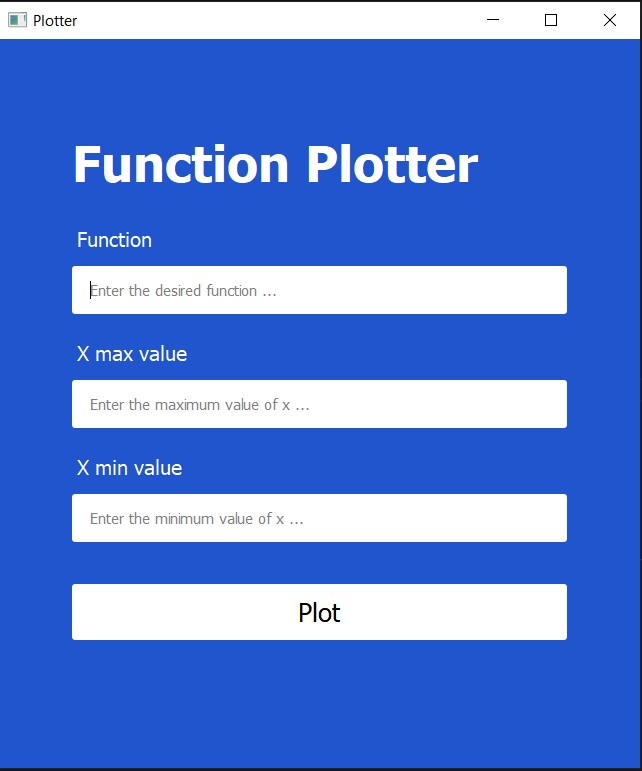
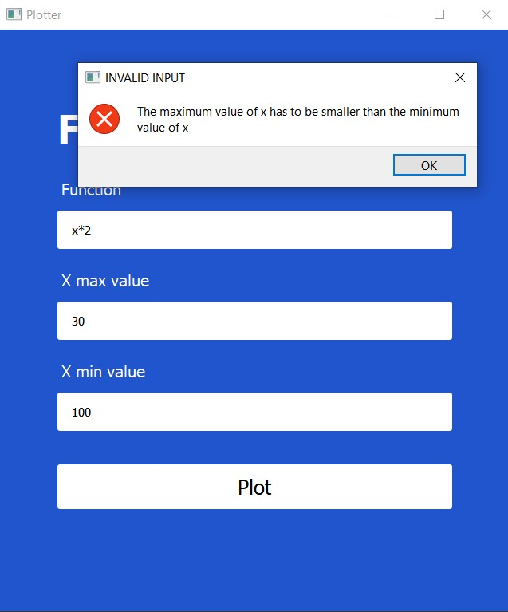
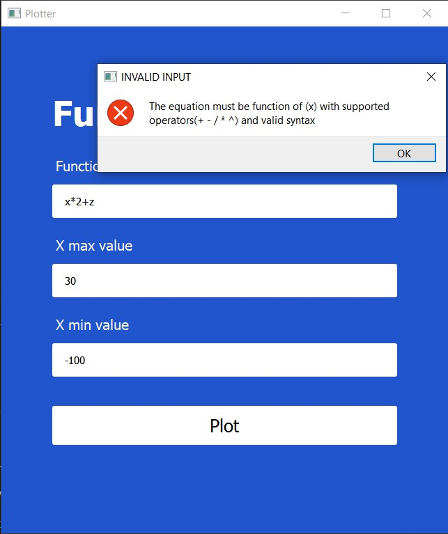
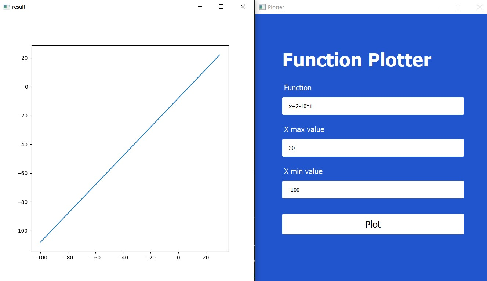
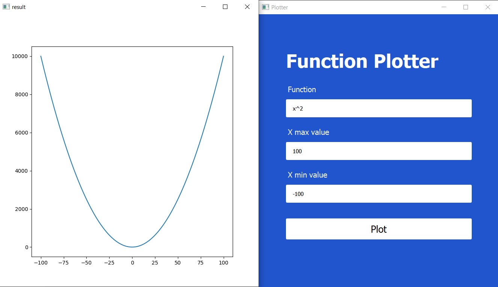

# Function-Plotter

```
This is a GUI application to plot functions in the form Y = F(X) using python
```
---
## **Technologies**
> **[Python](https://www.python.org/)**

> **[Qt designer](https://build-system.fman.io/#features)** 

> **[Python unittest](https://docs.python.org/3/library/unittest.html)**

> **[matplotlib](https://matplotlib.org/)**

---
## **Running**

1. **Navigate to source**
    ```
    $ cd source
    ```

2. **Running application**
    ```
    $ python app.py
    ```

3. **Running tests**
    ```
    $ python -m pytest
    ```
---
## **Snapshots**

---

---

---

---
